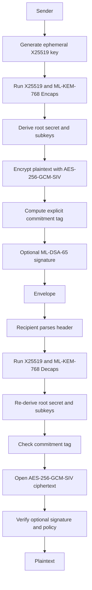

# Zeuz Design Report

## Executive summary

A defensible design for **Zeuz** is not a brand-new hardness assumption or a fresh “from-scratch” primitive. The safer path is to define Zeuz as an **opinionated, misuse-resistant, post-quantum-first envelope-and-session construction** built from already standardized components: **ML-KEM** for public-key key establishment, **ML-DSA** for signatures, **HKDF** or **KMAC/cSHAKE** for key derivation and domain separation, and a misuse-resistant AEAD such as **AES-GCM-SIV** for bulk encryption. NIST finalized **ML-KEM, ML-DSA, and SLH-DSA** in 2024, and later selected **HQC** as an additional backup KEM for standardization; in parallel, the IETF has standardized **HPKE** and **TLS 1.3**, and is actively standardizing post-quantum and hybrid KEM use in TLS. Those facts make a composition-first design more credible than novel number theory. citeturn25view0turn25view1turn25view2turn9search0turn19view2turn21view0turn19view0

The recommended Zeuz default profile for general-purpose servers and constrained clients is:

| Field | Recommended default |
|---|---|
| KEM | **Hybrid X25519 + ML-KEM-768** |
| KEM combiner | **HKDF-Extract with SHA-384** over both shared secrets and transcript-bound context |
| AEAD | **AES-256-GCM-SIV**, 128-bit tag, 96-bit nonce |
| Signature | **ML-DSA-65**, **hedged** signing, fixed protocol context string |
| Key commitment | **Explicit HMAC-SHA-384 commitment tag**, truncated to **16 bytes** |
| Transcript hash | **SHA-384** |
| Nonce strategy | **Per-direction base_nonce XOR sequence number**, with automatic overflow failure |
| Streaming | **Chunked AEAD** with chunk index in AAD, optional periodic rekey |
| Rekey for PCS | **Fresh hybrid KEM ratchet** mixed into root secret |

This profile is conservative for active attackers, survives accidental nonce reuse better than classic GCM or ChaCha20-Poly1305, provides explicit key binding at the protocol layer, and keeps the post-quantum migration story realistic. The alternatives that matter most are: **ML-KEM-1024** for a heavier higher-security profile; **Ascon-AEAD128** for very constrained devices; **SLH-DSA** as a conservative hash-based signature option when large signatures are acceptable; and **HQC** as a future agility path if lattice confidence shifts. citeturn12search0turn27view1turn29view0turn26view1turn36view2turn25view4turn28view0turn9search1

The main architectural recommendation is to split Zeuz into two closely related modes. **Zeuz-Envelope** is for stored objects, file/message sealing, and multi-recipient delivery. **Zeuz-Session** is for long-lived bidirectional channels with periodic rekey for forward secrecy and post-compromise recovery. Trying to force one mechanism to be simultaneously optimal for stored objects, asynchronous messaging, transport handshakes, and group messaging would recreate complexity already handled differently by HPKE, TLS 1.3, MLS, and Signal. citeturn19view2turn21view0turn19view3turn23view0

## Goals and threat model

Zeuz should target **active classical adversaries**, **harvest-now-decrypt-later quantum adversaries**, **malicious multi-user environments**, and **implementation-level attackers** who exploit timing leakage, fault injection, cache effects, replay, downgrade, malformed inputs, and nonce misuse. For KEMs, the baseline public-key goal should be **IND-CCA** under static public-key reuse, because active network attackers can tamper with ciphertexts and because recipient public keys will often be long-lived. Both FIPS 203 and current IETF guidance around ML-KEM assume that secure use under protocol composition requires exactly this kind of active-attack robustness. citeturn25view0turn19view0turn35view0

Zeuz also needs to distinguish two secrecy timelines. **Forward secrecy** means past traffic remains protected after later long-term compromise. **Backward secrecy**, more usefully expressed as **break-in recovery** or **post-compromise security**, means future traffic becomes secure again after compromise once fresh entropy is mixed in. TLS 1.3 provides forward secrecy and key-update-based protection for older traffic, while MLS and Signal’s ratcheting constructions are designed to provide stronger post-compromise recovery after fresh ratchet steps. Zeuz should therefore promise **forward secrecy for single-shot envelopes only when ephemeral KEM keys are used and deleted**, and **post-compromise security only in ratcheting session mode**, not in bare one-shot encryption. citeturn22view0turn22view1turn19view3turn23view0

Side-channel resilience must be treated as a first-class goal, not an implementation afterthought. The Kyber documentation explicitly discusses masking overheads and the importance of constant runtime and constant control flow; RFC 8439 likewise stresses constant-time arithmetic and constant-time tag comparison; and recent ML-DSA guidance recommends **hedged** rather than deterministic signing because it better tolerates side-channel and fault scenarios. A “superior” Zeuz design should therefore bias toward components and APIs that reduce misuse: fixed nonce derivation, no raw nonce entry in the high-level API, input validation before decapsulation, constant-time tag checks, mandatory secret erasure, and hedged signing by default. citeturn14view3turn31view1turn36view2

A final goal tension is conceptual rather than mathematical: **non-repudiation and deniability pull in opposite directions**. NIST’s ML-DSA standard explicitly frames signatures as supporting non-repudiation to third parties, while X3DH and Signal’s messaging lineage emphasize deniability. Zeuz should not pretend to optimize both at once. It should define a **signed profile** for archives, software update artifacts, auditable envelopes, and compliance use cases; and a separate **deniable session profile** without sender signatures when deniability matters more than third-party proof. citeturn25view1turn23view1

A practical property summary for Zeuz is below.

| Property | Zeuz target | Primary mechanism |
|---|---|---|
| Confidentiality | IND-CCA-style active security | Hybrid KEM + AEAD |
| Ciphertext integrity | INT-CTXT / AEAD authenticity | AEAD tag |
| Misuse resistance | Graceful nonce-reuse behavior | AES-GCM-SIV default |
| Key commitment | Explicit binding of key, header, and ciphertext | Commitment MAC derived from shared secret |
| Forward secrecy | Yes, with ephemeral KEM and key deletion | Fresh per-envelope/session KEM shares |
| Post-compromise security | Session mode only | Periodic rekey/ratchet |
| Non-repudiation | Signed profile only | ML-DSA |
| Deniability | Unsigned session profile | No third-party-verifiable sender signature |

This summary aligns with HPKE’s CCA-oriented secrecy goals, TLS’s forward secrecy model, MLS’s PCS target, Signal’s ratchet properties, and NIST’s signature and KEM standards. citeturn20view0turn22view1turn19view3turn23view0turn25view1turn25view0

## Primitive selection and tradeoffs

For Zeuz’s public-key core, the strongest default choice is **hybrid X25519 + ML-KEM-768**. X25519 is compact and ubiquitous, while ML-KEM-768 gives NIST category 3 post-quantum security with modest key and ciphertext sizes. Hybrid exchange is the right migration posture because the IETF’s hybrid TLS design explicitly aims to preserve security if all but one component remain secure, and the current TLS ML-KEM work centers ML-KEM as the post-quantum KEM for transport migration. citeturn12search0turn27view1turn19view0turn19view1

| KEM candidate | Security basis and status | Sizes | Advantages | Drawbacks | Zeuz role |
|---|---|---:|---|---|---|
| **ML-KEM-768** | NIST FIPS 203, category 3 | pk 1184 B, sk 2400 B, ct 1088 B, ss 32 B | Best balance of size and security; standardized; fast | Larger than ECC; lattice confidence only | **Default PQ KEM** |
| **ML-KEM-1024** | NIST FIPS 203, category 5 | pk 1568 B, sk 3168 B, ct 1568 B, ss 32 B | Higher margin | More bandwidth and CPU | High-security archival profile |
| **X25519** | RFC 7748 classical ECDH | pk/ss 32 B | Tiny, ubiquitous, fast | Broken by large quantum computers | Hybrid migration component |
| **X448** | RFC 7748 classical ECDH | pk/ss 56 B | Higher classical margin | Bigger/slower than X25519 | Optional stronger hybrid component |
| **HQC** | NIST-selected backup KEM for standardization | not yet final FIPS here | Different code-based family; agility hedge | Standardization and ecosystem maturity still developing | Future agility path, not default |

The ML-KEM sizes and categories are from FIPS 203; X25519/X448 encodings are from RFC 7748; HQC’s role as a backup KEM comes from NIST’s 2025 selection and PQC project pages. citeturn27view1turn12search0turn9search0turn9search1

For signatures, **ML-DSA-65** is the best default. It sits at NIST category 3, has materially smaller signatures than SLH-DSA, and NIST now standardizes it directly. The biggest caveat is implementation discipline: use **hedged signing** and a fixed protocol context string. **SLH-DSA-SHAKE-192s** is the conservative backup if you prioritize hash-based security over bandwidth. **FN-DSA/Falcon** remains worth watching for compact signatures, but “watching” is different from “making it the conservative default.” citeturn26view1turn36view2turn28view0turn9search1

| Signature candidate | NIST status | Public key / signature size | Advantages | Drawbacks | Zeuz role |
|---|---|---:|---|---|---|
| **ML-DSA-65** | FIPS 204, category 3 | 1952 B / 3309 B | Good size/performance balance; standardized | Larger than classical signatures; lattice implementation care needed | **Default signature** |
| **ML-DSA-87** | FIPS 204, category 5 | 2592 B / 4627 B | Larger margin | More bandwidth | High-security profile |
| **SLH-DSA-SHAKE-192s** | FIPS 205, category 3 | 48 B / 16,224 B | Conservative hash-based assumption | Huge signatures | Conservative fallback / root certs |
| **SLH-DSA-SHAKE-256s** | FIPS 205, category 5 | 64 B / 29,792 B | High assurance, category 5 | Very large signatures | Niche archival-only use |
| **FN-DSA / Falcon** | Ongoing NIST standardization track | compact in principle | Attractive compactness | Not the most conservative 2026 default | Watchlist, not default |

The ML-DSA and SLH-DSA sizes come directly from FIPS 204 and FIPS 205. The caution that SLH-DSA may need extra treatment when an application requires message-bound signatures also comes from FIPS 205. citeturn26view1turn28view0turn28view3

For the symmetric layer, Zeuz should prefer **misuse resistance over peak benchmark speed**. **AES-GCM-SIV** is designed not to fail catastrophically if a nonce repeats. **ChaCha20-Poly1305** stays attractive for software-only platforms and constant-time implementation quality, but RFC 8439 is unambiguous that nonce reuse is dangerous and that tags should not be truncated. **Ascon-AEAD128** is a strong constrained-device option, especially now that NIST finalized SP 800-232; it remains nonce-based, but NIST’s standard discusses multi-key security and a nonce-masking option for resilience. citeturn29view0turn31view1turn25view4turn33view0turn33view3

| Symmetric/KDF candidate | Why use it | Why not make it the only choice |
|---|---|---|
| **AES-256-GCM-SIV** | Misuse-resistant AEAD; 96-bit nonce; 128-bit tag; excellent default on AES-accelerated CPUs | Slightly more overhead and less ubiquitous than AES-GCM |
| **ChaCha20-Poly1305** | Excellent software performance and constant-time properties on hardware without AES acceleration | Requires strict nonce uniqueness; full tag should be kept |
| **Ascon-AEAD128** | NIST lightweight standard; good constrained-device fit | 128-bit security ceiling; less common in mainstream transports |
| **HKDF-SHA-384** | Interoperable with IETF designs; extract-then-expand; good transcript binding via salt/info | Less NIST-specific than KMAC/cSHAKE |
| **KMAC256 / cSHAKE256** | Strong built-in domain separation and customization strings | Weaker interoperability with existing HPKE/TLS ecosystems |

The defaults above follow RFC 8452, RFC 8439, RFC 5869, NIST SP 800-232, and NIST SP 800-185. citeturn29view0turn31view1turn32view3turn34view2turn34view3

## Zeuz construction

Zeuz should be specified as an **envelope format plus session ratchet**, not merely “a cipher.” The cleanest abstraction is:

- **Zeuz-Envelope**: single-shot sealing/opening of objects or messages, optionally signed, optionally multi-recipient.
- **Zeuz-Session**: a ratcheted channel that repeatedly derives fresh traffic keys from a root secret and periodic fresh hybrid KEM inputs.

This borrows HPKE’s separation of **KEM + KDF + AEAD** and its exporter-style design while adding explicit commitment, signature semantics, and a migration-ready hybrid KEM layer. citeturn19view2turn20view1turn20view2

### Recommended default profile

| Parameter | Exact value |
|---|---|
| Suite ID | `zeuz-v1-hybrid-x25519-mlkem768-hkdfsha384-aes256gcmsiv-mldsa65` |
| Classical KEM limb | `X25519` |
| PQ KEM limb | `ML-KEM-768` |
| Shared-secret combiner | `HKDF-Extract(salt = SHA-384(protocol_context), IKM = len(ss_ec)||ss_ec||len(ss_pq)||ss_pq)` |
| Root transcript hash | `SHA-384` |
| AEAD | `AES-256-GCM-SIV` |
| AEAD key size | `32 bytes` |
| AEAD nonce | `12 bytes` |
| AEAD tag | `16 bytes` |
| Commitment MAC | `HMAC-SHA-384`, truncated to `16 bytes` |
| Signature | `ML-DSA-65` |
| Signature mode | `hedged/randomized` |
| Signature context | `"Zeuz-Sign-v1"` |
| KDF labels | fixed ASCII labels under `"Zeuz-v1"` namespace |
| Sequence field | `uint64` per direction; fail on overflow |

The specific sizes and algorithm properties come from RFC 7748, FIPS 203, RFC 8452, RFC 5869, and FIPS 204. The explicit commitment tag is a Zeuz design choice added because standard AEAD is not the same as committing AE and because ML-KEM protocol guidance notes edge-case misbinding notions under adversary-controlled secret keys. citeturn12search0turn27view1turn29view0turn32view0turn26view1turn6search4turn6search7turn35view0

### Envelope layout

A Zeuz envelope header should minimally bind: version, suite identifier, mode, recipient count, sender key identifier if present, hybrid encapsulation material, chunk or sequence metadata, flags, and an authenticated hash of external associated data. The **suite/version must be committed and signed**, not just parsed, so that downgrade attempts become transcript failures rather than negotiation ambiguities. This is a lesson reinforced by TLS’s careful handling of compatibility and by HPKE’s requirement that applications define an unambiguous wire format and context binding. citeturn22view3turn20view0

```mermaid
flowchart LR
    A[Recipient classical PK] --> B[Hybrid KEM]
    C[Recipient PQ PK] --> B
    D[Sender ephemeral X25519] --> B
    B --> E[ss_ec || ss_pq]
    E --> F[HKDF-Extract with transcript salt]
    G[Header fields + AAD hash] --> F
    F --> H[Root secret]
    H --> I[AEAD key]
    H --> J[Base nonce]
    H --> K[Commitment key]
    H --> L[Exporter secret]
```

### Seal and Open flow

For the signed profile, the sender performs an X25519 ephemeral exchange, an ML-KEM encapsulation, derives the root secret with HKDF-SHA-384, encrypts with AES-256-GCM-SIV, computes an explicit commitment tag over header and ciphertext, and then optionally signs the transcript hash with ML-DSA-65 using a fixed context string. Verification order should be **parse → constant-time recomputation of commitment → AEAD open → signature verification policy**, though systems that require sender authentication before plaintext release may verify the signature before decryption. HPKE and TLS both show that stateful nonce management and transcript-bound key schedules are the right pattern; Zeuz simply hardens that pattern further for stored-object use. citeturn20view1turn20view3turn21view0



### Pseudocode

The following pseudocode is Zeuz-specific, but it deliberately follows the HPKE/TLS pattern of **extract-then-expand**, transcript binding, stateful nonces, and role-specific keys. citeturn20view1turn32view0

```text
const SUITE_ID = "zeuz-v1-hybrid-x25519-mlkem768-hkdfsha384-aes256gcmsiv-mldsa65"
const SIG_CTX  = "Zeuz-Sign-v1"
const KC_CTX   = "Zeuz-Commit-v1"

function HybridExtract(ss_ec, ss_pq, protocol_context):
    salt = SHA384("Zeuz-KEM-Salt" || protocol_context)
    ikm  = I2OSP(len(ss_ec), 2) || ss_ec || I2OSP(len(ss_pq), 2) || ss_pq
    return HKDF-Extract(salt, ikm)

function KeySchedule(prk_hybrid, transcript_hash, role):
    salt = SHA384("Zeuz-Root" || role || transcript_hash)
    root = HKDF-Extract(salt, prk_hybrid)

    aead_key   = HKDF-Expand(root, "aead-key",   32)
    base_nonce = HKDF-Expand(root, "base-nonce", 12)
    commit_key = HKDF-Expand(root, "commit-key", 32)
    exporter   = HKDF-Expand(root, "exporter",   48)

    return (aead_key, base_nonce, commit_key, exporter)

function Nonce(base_nonce, seq_u64):
    seq96 = 0x00000000 || I2OSP(seq_u64, 8)
    return XOR(base_nonce, seq96)

function Seal(pkR_ec, pkR_pq, aad, plaintext, optional skS):
    esk_ec   = X25519_Generate()
    enc_ec   = X25519_Public(esk_ec)
    ss_ec    = X25519(esk_ec, pkR_ec)

    (enc_pq, ss_pq) = MLKEM768_Encaps(pkR_pq)

    header0 = EncodeHeader(
        version = 1,
        suite_id = SUITE_ID,
        mode = (skS != NULL ? "signed" : "base"),
        enc_ec = enc_ec,
        enc_pq = enc_pq,
        aad_hash = SHA384(aad),
        seq = 0
    )

    transcript_hash = SHA384(header0)
    prk_hybrid = HybridExtract(ss_ec, ss_pq, header0)
    (k, n0, kcom, exporter) = KeySchedule(prk_hybrid, transcript_hash, "S")

    ct = AES256_GCM_SIV_Seal(k, Nonce(n0, 0), header0 || aad, plaintext)
    kc = Trunc16(HMAC_SHA384(kcom, KC_CTX || header0 || ct))

    header = header0 || kc

    if skS != NULL:
        sig_msg = SHA384(header || ct)
        sig = MLDSA65_Sign_Hedged(skS, sig_msg, SIG_CTX)
    else:
        sig = ""

    return EncodeEnvelope(header, ct, sig)

function Open(skR_ec, skR_pq, aad, envelope, optional pkS):
    (header, ct, sig) = ParseEnvelope(envelope)
    Require(header.version == 1)
    Require(header.suite_id == SUITE_ID)
    Require(header.aad_hash == SHA384(aad))

    ss_ec = X25519(skR_ec, header.enc_ec)
    ss_pq = MLKEM768_Decaps(skR_pq, header.enc_pq)

    header0 = header without trailing kc
    transcript_hash = SHA384(header0)
    prk_hybrid = HybridExtract(ss_ec, ss_pq, header0)
    (k, n0, kcom, exporter) = KeySchedule(prk_hybrid, transcript_hash, "R")

    kc_check = Trunc16(HMAC_SHA384(kcom, KC_CTX || header0 || ct))
    ConstantTimeEqual(header.kc, kc_check) or FAIL

    plaintext = AES256_GCM_SIV_Open(k, Nonce(n0, 0), header0 || aad, ct)
    if plaintext == FAIL:
        return FAIL

    if sig != "":
        pkS != NULL or FAIL
        sig_msg = SHA384(header || ct)
        MLDSA65_Verify(pkS, sig_msg, sig, SIG_CTX) or FAIL

    return plaintext
```

### Sign, verify, and non-repudiation mode

Zeuz should define signatures over the **canonical envelope transcript**, not over arbitrary caller-chosen bytes. That transcript should include the suite ID, version, sender key ID, recipient binding information, encapsulations, ciphertext, commitment tag, and application context string. ML-DSA context strings exist specifically to provide domain separation between applications or protocol uses of the same key pair, and the current guidance is clear that **hedged signing is the safer default**. Non-repudiation then becomes an operational property of “ML-DSA signature + authenticated public-key binding + stable timestamp/logging,” not just an algebraic property. citeturn36view3turn36view2turn25view1

```text
function Sign(skS, transcript):
    digest = SHA384(transcript)
    return MLDSA65_Sign_Hedged(skS, digest, "Zeuz-Sign-v1")

function Verify(pkS, transcript, sig):
    digest = SHA384(transcript)
    return MLDSA65_Verify(pkS, digest, sig, "Zeuz-Sign-v1")
```

### Multi-recipient, streaming, and resumable sessions

For **multi-recipient envelopes**, Zeuz should not re-encrypt the bulk payload for every recipient. Instead, generate a random **content seed** `ms`, derive a single payload key from `ms`, encrypt the content once, and then perform one hybrid KEM encapsulation per recipient to wrap `ms` (or a short wrapping seed). This is the HPKE-style separation of asymmetric key setup from DEM payload encryption, adapted to an object envelope. The result is linear header growth in the number of recipients but only one ciphertext body. citeturn19view2turn35view0

For **streaming**, Zeuz should divide plaintext into chunks and authenticate the tuple `(stream_id, chunk_index, final_flag, chunk_len)` as AAD for every chunk. Rekey can be done by deriving fresh per-chunk material from an exporter secret, or more conservatively by rotating the root secret after a fixed volume threshold. This mirrors TLS’s use of sequence-based nonces and key updates without duplicating the whole transport stack. citeturn20view1turn22view0

For **resumable sessions** and **post-compromise recovery**, Zeuz-Session should maintain:

- a long-lived root secret,
- per-direction sequence counters,
- per-direction traffic keys,
- and a periodic **Rekey()** that mixes a fresh hybrid KEM output into the root secret.

That rekey design is conceptually closer to MLS or Signal than to HPKE single-shot encryption. The guarantee should be stated carefully: once a compromised endpoint regains honest control and performs a fresh rekey, future messages can recover security, provided prior compromised state was erased. citeturn19view3turn23view0

## Security analysis and attack review

The right proof target for Zeuz-Envelope is a **KEM/DEM signcryption-style composition theorem**. At a high level, one can structure the reduction as follows. First, replace the optional signature with an ideal verification oracle; the distinguishing gap is bounded by the **UF-CMA/SUF-CMA** security of ML-DSA. Next, replace the commitment tag with a random function under the **PRF security of HMAC-SHA-384**. Then replace the AEAD with an ideal authenticated encryption oracle, paying the **IND-CPA/INT-CTXT** or misuse-resistant AEAD advantage. Finally, replace the hybrid shared secret with a random secret: the gap is bounded by the security of the hybrid combiner and the underlying KEM assumptions. Fujisaki–Okamoto-style transforms are the classic tool for turning weaker public-key encryption into **IND-CCA** public-key encryption/KEMs in the random oracle model, and ML-KEM inherits a tweaked FO structure through the Kyber lineage. citeturn11search7turn11search12turn35view0turn16view1

For the **hybrid KEM**, the extraction combiner should be modeled as a robust randomness extractor over two independently generated shared secrets. The IETF’s hybrid TLS design states the core objective plainly: combine multiple key exchanges so security remains if all but one component fail. In Zeuz, that means the session root remains pseudorandom if either the X25519 limb survives classical attack or the ML-KEM limb survives post-quantum attack, assuming the combiner binds the transcript and both components are domain separated. HKDF is suitable here specifically because extract-then-expand is designed to distill input keying material into pseudorandom traffic secrets and to bind context via salt/info. citeturn19view0turn32view0turn32view3

For **signatures**, the security story is standard but nuanced. Dilithium/ML-DSA is designed for standard digital-signature security under message attacks; its specification and supporting documentation discuss security under classical and quantum random-oracle settings, relying on module-LWE and module-SIS-style assumptions. The operational lesson is more important than the proof detail for Zeuz: **use hedged signing**, use a fixed context string, and never let the caller provide raw protocol transcript fragments that can vary by serialization. citeturn16view1turn36view2turn36view3

The explicit **key commitment** layer is worth the extra bytes. Recent literature distinguishes ordinary AEAD from **committing AE**, where the ciphertext better binds to the key and context. That distinction matters because protocol-level confusion attacks, recipient mix-ups, or deliberately malformed key material can create “same ciphertext, wrong contextual interpretation” problems even when a normal AEAD tag verifies. Current ML-KEM security guidance also notes mal-binding notions when an adversary controls impossible secret keys, and the 2024 formal analysis of Signal’s PQXDH highlighted the need for an extra KEM binding property in protocol proofs. Zeuz’s explicit commitment tag is therefore a sound protocol-layer defense, even though it is not part of base HPKE. citeturn6search4turn6search7turn35view0turn24search11

Attack scenarios and mitigations are summarized below.

| Attack or misuse case | Risk | Zeuz response |
|---|---|---|
| Nonce reuse | Catastrophic in classic GCM and ChaCha20-Poly1305; less severe but still undesirable elsewhere | Use AES-GCM-SIV by default, derive nonces from hidden base nonce and monotone sequence |
| Downgrade to weaker suite | Loss of PQ or misuse-resistant properties | Bind version and suite ID into commitment and signature transcript |
| Replay | Re-accepting an old envelope or chunk | Include sequence/chunk index and application replay cache policy |
| KEM malformed-input bugs | Decapsulation side channels and parsing issues | Mandatory key/ciphertext input checks before decapsulation |
| Sender-key ambiguity or wrong-recipient opening | Context confusion | Explicit commitment MAC over header and ciphertext |
| Fault injection on signatures | Key recovery risks in deterministic signing | Hedged ML-DSA only by default |
| Side-channel leaks | Key extraction through timing/cache/power | Constant-time arithmetic, fixed parsing, masking where needed, secure deletion |
| Truncated or varied tags | Weaker authenticity bounds | Keep full 128-bit AEAD tag and fixed 16-byte commitment tag |
| Group or asynchronous PCS expectations from a simple envelope | Overclaiming security | Reserve PCS claims for Zeuz-Session ratchet mode only |

These mitigations are grounded in RFC 8452, RFC 8439, FIPS 203, current ML-DSA guidance, and recent protocol-analysis literature. citeturn29view0turn31view1turn27view2turn36view2turn24search11

## Performance and implementation guidance

For the default profile, the **bandwidth overhead** is dominated by the PQ KEM and, if present, the signature. A single-recipient unsigned envelope adds approximately: **32 B** for the X25519 ephemeral public key, **1088 B** for the ML-KEM-768 ciphertext, **16 B** for the AES-GCM-SIV tag, **16 B** for the explicit commitment tag, plus a compact header. A signed envelope then adds about **3309 B** for ML-DSA-65. In round numbers, Zeuz unsigned envelopes are roughly **~1.2 KB plus header**, and signed envelopes are roughly **~4.5 KB plus header** before payload compression or framing. citeturn12search0turn27view1turn26view1turn29view0

On server-class CPUs, the public-key operations are fast enough that Zeuz will usually be **bandwidth-bound, not CPU-bound**, for medium and large payloads. The Kyber round-3 specification reports roughly **52,732 / 67,624 / 53,156 AVX2 cycles** for key generation / encapsulation / decapsulation at the Kyber768 level, and the Dilithium round-3 spec reports roughly **153,856 / 296,201 / 102,396 AVX2+AES cycles** for ML-DSA-65-like key generation / signing / verification. Interpreted very roughly on a 3 GHz core, that is on the order of **tens of microseconds for ML-KEM-768** and about **0.1 ms for ML-DSA-65 signing**. Those conversions are an inference from the published cycle counts and should be treated as order-of-magnitude guidance, not interoperability limits. citeturn15view1turn18view0

On constrained Cortex-M4-class systems, the same Kyber documentation reports that optimized **Kyber768** operations take about **756k / 916k / 853k cycles** with about **3292 / 2980 / 3004 bytes of RAM** for key generation / encapsulation / decapsulation. That makes Zeuz feasible on embedded clients, but it also explains why a constrained profile should consider **Ascon-AEAD128** for the symmetric layer and should avoid oversized signature schemes unless they are truly needed. citeturn37view1turn37view3turn25view4

Implementation quality will dominate real security. The high-level guidance is straightforward:

- keep all secret-dependent code paths constant time;
- avoid generic bigint libraries for Poly1305-like arithmetic;
- use constant-time tag comparison;
- validate ML-KEM inputs before decapsulation;
- erase ephemeral secrets, seeds, and derived traffic keys as soon as possible;
- prefer expanded secret-key caching only when the memory/performance tradeoff is explicit and audited;
- and use hedged ML-DSA signing with whatever randomness source is available, even on constrained devices. citeturn31view1turn14view3turn35view0turn36view2

The **safe-default API** should refuse dangerous knobs. In particular, the high-level API should not allow the caller to supply an arbitrary nonce in default mode; should require a typed recipient key bundle containing both classical and PQ public keys when hybrid mode is selected; should force explicit selection between `signed` and `deniable` profiles; and should expose exporters and rekey handles, not raw root secrets. A good minimal surface is:

```text
Zeuz.Seal(recipients, aad, plaintext, options) -> envelope
Zeuz.Open(recipient_secret_bundle, aad, envelope, options) -> plaintext
Zeuz.Sign(signing_key, transcript) -> signature
Zeuz.Verify(verification_key, transcript, signature) -> bool
Zeuz.SessionStart(peer_keys, options) -> session_state
Zeuz.SessionSeal(session_state, aad, plaintext) -> record
Zeuz.SessionOpen(session_state, aad, record) -> plaintext
Zeuz.Rekey(session_state, peer_keys) -> session_state
```

For test coverage, publish **golden known-answer vectors** for every mode, plus negative vectors: modified suite ID, wrong context string, wrong recipient, tampered ciphertext, tampered commitment tag, replayed chunk index, malformed ML-KEM ciphertext, and deterministic-vs-hedged signing behavior. NIST PQC submissions and RFC 5869 both illustrate how valuable fixed vectors are for independent implementations and regression testing. citeturn15view0turn32view3

## Migration, interoperability, and comparison

Zeuz should be intentionally **hybrid first** during migration. In certificate-based ecosystems, use **PQ/T hybrid certificates** or equivalent authenticated bundles that bind both the classical and post-quantum public keys to the same identity. During the transition, hybrid keys give operators room to keep legacy trust anchors and classical code paths alive while PQ support rolls out incrementally. This transition language is now standardized enough that Zeuz can align with it instead of inventing new terminology. citeturn12search15turn9search1

Interoperability should be defined at two layers. At the **cryptographic component layer**, Zeuz can borrow HPKE’s ciphersuite taxonomy, stateful-sequence AEAD model, and exporter semantics. At the **wire-format layer**, Zeuz should remain distinct, because it adds explicit commitment, signatures, multi-recipient object wrapping, and ratcheting semantics that HPKE itself intentionally leaves to applications. Similarly, Zeuz-Session can borrow ideas from TLS 1.3 key updates, MLS rekey trees, and Signal ratchets, but it should not claim wire compatibility with any of them. citeturn19view2turn20view1turn21view0turn19view3turn23view0

The visual style for a Zeuz object envelope can follow a PITHOS-like split between recipient-wrapping material, ciphertext body, and optional signature, while the cryptographic substance remains grounded in current NIST and IETF components.


A concise comparison appears below.

| Scheme | Best fit | FS / PCS | Multi-recipient | Non-repudiation | PQ posture | Where Zeuz is stronger | Where Zeuz is weaker |
|---|---|---|---|---|---|---|---|
| **HPKE** | Single-recipient public-key encryption framework | No ratchet by itself | Not object-level multi-recipient by itself | Optional auth modes, not signature-first | PQ work ongoing around ecosystem | Zeuz adds commitment, signatures, multi-recipient envelope, ratchet profile | HPKE is already standardized and simpler |
| **TLS 1.3** | Transport channels | FS, key updates; limited PCS notion | No | Certificate-based auth | Hybrid/PQ migration in progress | Zeuz handles stored objects and recipient envelopes | TLS is far more deployed and optimized for transport |
| **MLS** | Large asynchronous secure groups | FS + PCS by design; log-scale group updates | Yes, group-native | Typically identity-authenticated, not archive-signature-centric | PQ migration still ecosystem dependent | Zeuz is much simpler for files and small recipient sets | MLS is better for real group messaging |
| **Signal / PQXDH + ratchet** | Asynchronous two-party messaging | Strong ratchet-based FS and PCS | Two-party / messaging-centric | Deniability emphasized, not non-repudiation | PQXDH gives post-quantum forward secrecy in setup | Zeuz is better for auditable, signed envelopes and multi-recipient objects | Signal is better for deniable asynchronous chat |
| **Zeuz** | Signed or unsigned sealed objects plus optional ratcheted sessions | FS in envelope mode; FS+PCS in session mode | Yes | Yes, in signed profile | Hybrid-by-default, pure PQ option | Balanced object/session design, commitment, misuse resistance | More bespoke than HPKE/TLS; needs careful specification |

The comparison points above come from RFC 9180 for HPKE, RFC 8446 for TLS 1.3, RFC 9420 for MLS, and the Signal X3DH / Double Ratchet / PQXDH materials. citeturn19view2turn21view0turn19view3turn23view1turn23view0turn24search0

The bottom-line recommendation is therefore crisp: **define Zeuz as a composable, hybrid KEM/DEM envelope and session specification, not as fresh algebra**. Make **X25519 + ML-KEM-768 + HKDF-SHA-384 + AES-256-GCM-SIV + explicit commitment + ML-DSA-65 hedged signatures** the default profile. Add **Ascon-AEAD128** for constrained devices, **ML-KEM-1024** for heavier security margins, **SLH-DSA** for conservative hash-based fallback, and **HQC** as a future agility branch. That gives Zeuz a credible claim to being “superior” in the ways that matter in 2026: better migration posture, safer defaults, better misuse behavior, explicit commitment, and cleaner separation between archival non-repudiation and deniable messaging. citeturn27view1turn29view0turn26view1turn36view2turn25view4turn9search1